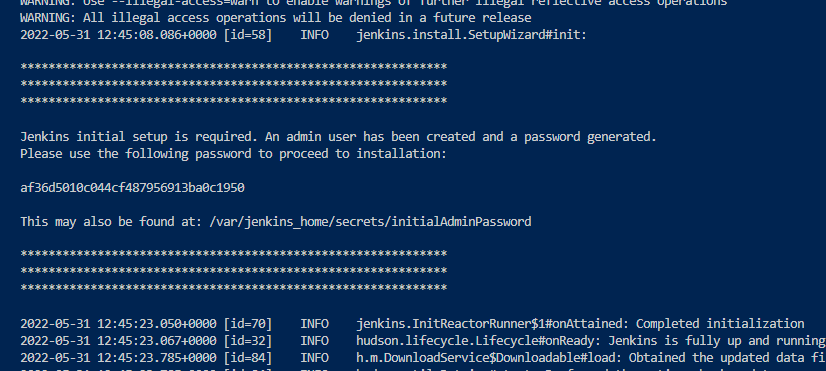
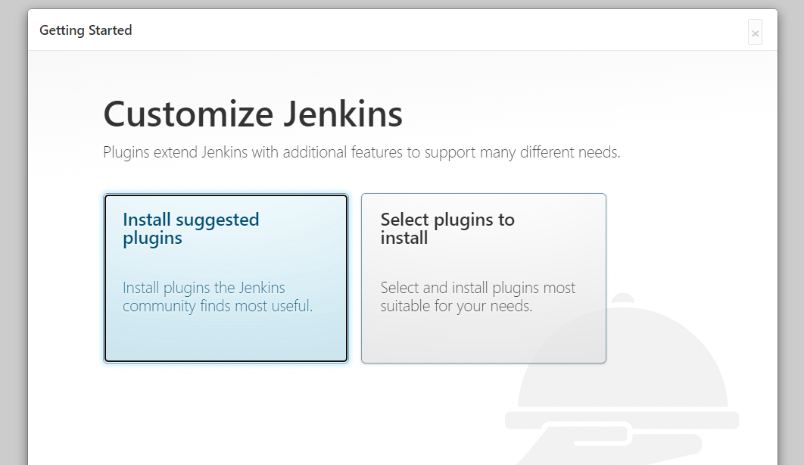
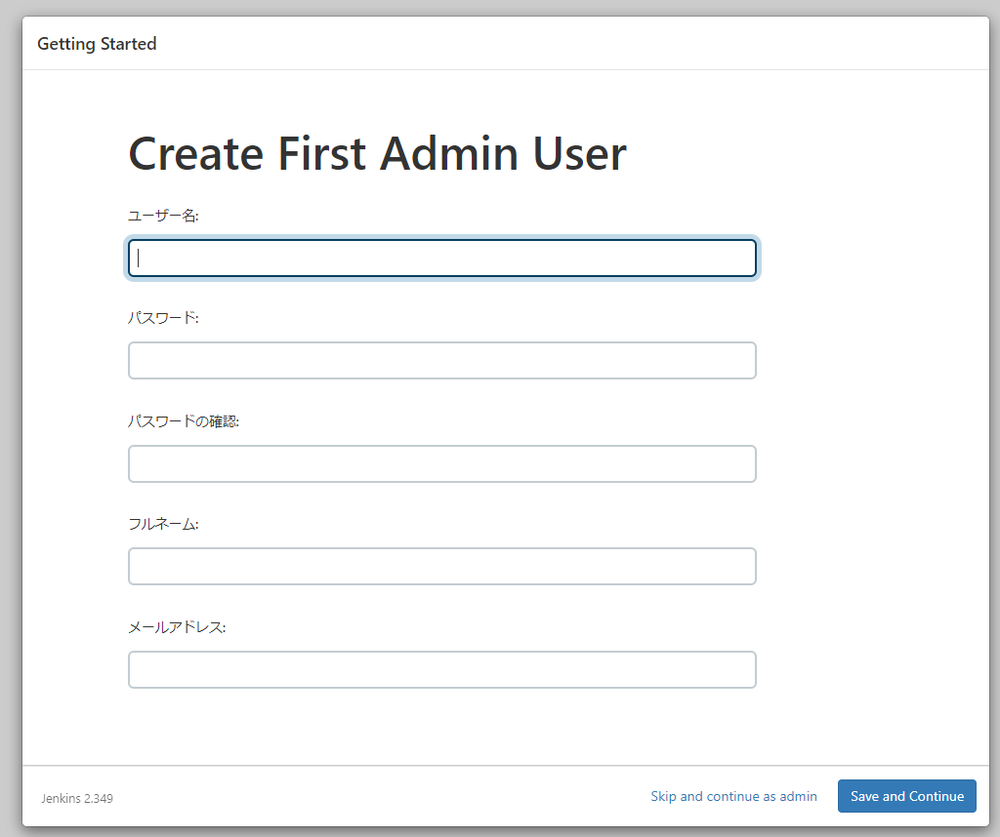

# Try to use Jenkins

## Set up Jenkins server with Docker

Run Jenkins server on localhost

```bash
docker pull jenkins/jenkins:latest
docker run --name jenkins -p 8080:8080 -p 5000:5000 jenkins/jenkins
```

Access to `localhost:8080`

Log in with the initial password, you can find the password in your terminal.


Choose one of them


You can skip to create first admin user. Push the button "Skip and continue as admin".


## Create pipeline job

## Set up your git repository so that Jenkins can ssh to your repo

## Prepare JenkinsFile

## 'git push' to your repo

## Stop container

```bash
docker stop jenkins
```
